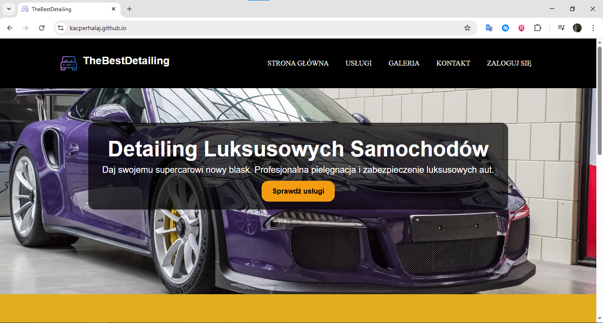
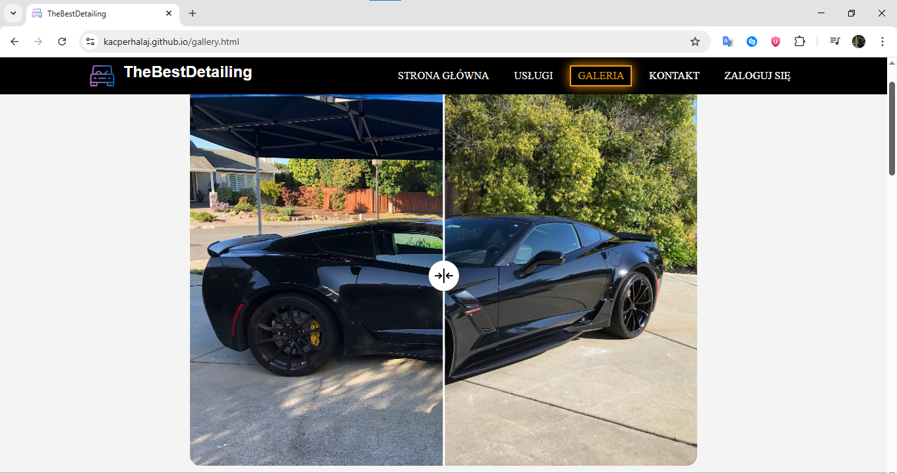
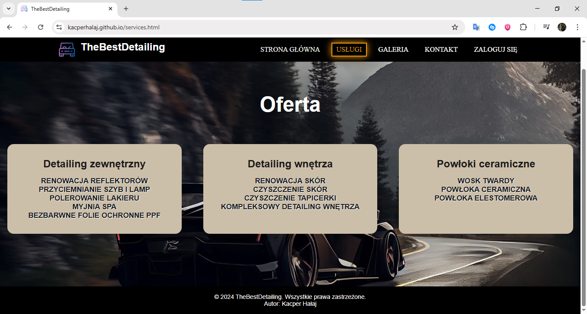
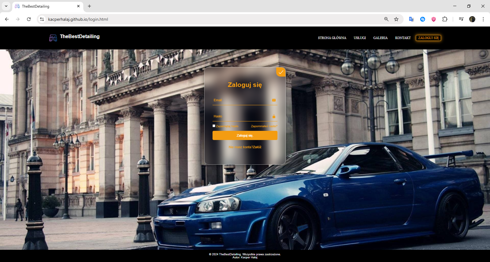

# Website Project

Responsywna witryna internetowa zbudowana w HTML, CSS i JavaScript, zapewniająca użytkownikom bezproblemową obsługę.



---

## Spis treści

1. [Opis projektu](#opis-projektu)
2. [Technologie](#technologie)
3. [Struktura projektu](#struktura-projektu)
4. [Główne funkcjonalności](#główne-funkcjonalności)
5. [Prezentacja wybranych ekranów](#prezentacja-wybranych-ekranów)
6. [Autor](#autor)

---

## Opis projektu

Projekt jest responsywną stroną internetową demonstrującą najważniejsze elementy nowoczesnego frontendu. Został przygotowany z myślą o użytkowniku – interfejs jest przejrzysty, czytelny i wygodny zarówno na komputerach, jak i urządzeniach mobilnych.

---

## Technologie

- HTML
- CSS
- JavaScript

---

## Struktura projektu

```
Website-project/
├── css/            # Arkusze stylów
├── img/            # Zrzuty ekranu i grafiki
│   ├── EkranGlowny.png
│   ├── Galeria.png
│   ├── Kontakt.png
│   ├── Logowanie.png
│   └── Uslugi.png
├── js/             # Skrypty JavaScript
├── index.html      # Strona główna
├── README.md
└── ...
```

---

## Główne funkcjonalności

- **Strona główna**  
  Przejrzysty opis serwisu oraz nawigacja do pozostałych sekcji.

- **Galeria**  
  Prezentacja wybranych zdjęć/grafik z możliwością przeglądania.

- **Usługi**  
  Szczegółowy opis oferowanych usług.

- **Logowanie**  
  Responsywny formularz logowania dla użytkowników.

- **Kontakt**  
  Formularz kontaktowy umożliwiający wysłanie wiadomości bezpośrednio ze strony.

Całość jest w pełni responsywna – automatycznie dostosowuje się do różnych urządzeń i rozdzielczości ekranu.

---

## Prezentacja wybranych ekranów

### Strona główna


### Galeria



### Usługi



### Logowanie



### Kontakt


---

## Autor

kacperhalaj
